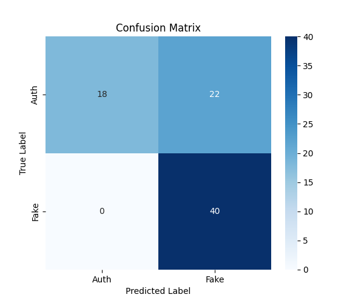
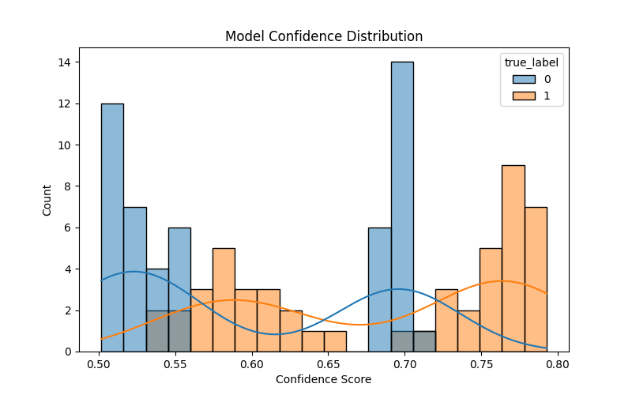
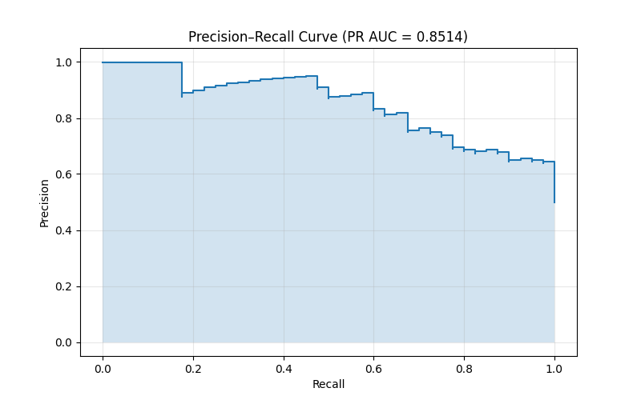

# Evaluation Report

## Metrics
- **Accuracy**: 0.7250
- **Precision**: 0.6452
- **Recall**: 1.0000
- **F1 Score**: 0.7843
- **MCC**: 0.5388
- **Specificity (TNR)**: 0.4500
- **False Positive Rate (FPR)**: 0.5500
- **PR AUC**: 0.8514

## Visualizations
### Confusion Matrix


### Confidence Distribution


### Precision–Recall Curve


## Classification Report
```
              precision    recall  f1-score   support

   Authentic       1.00      0.45      0.62        40
 Manipulated       0.65      1.00      0.78        40

    accuracy                           0.72        80
   macro avg       0.82      0.72      0.70        80
weighted avg       0.82      0.72      0.70        80

```
    